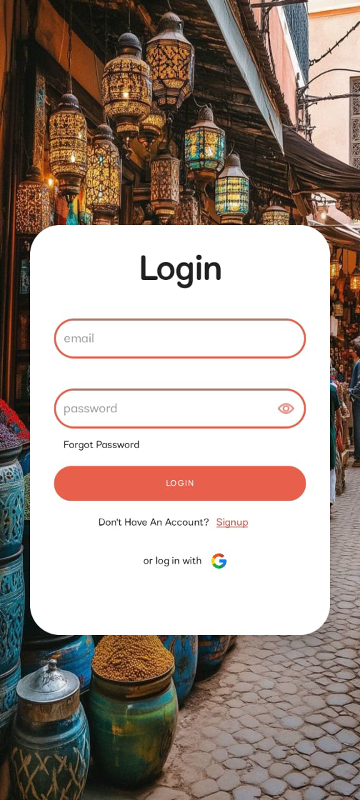
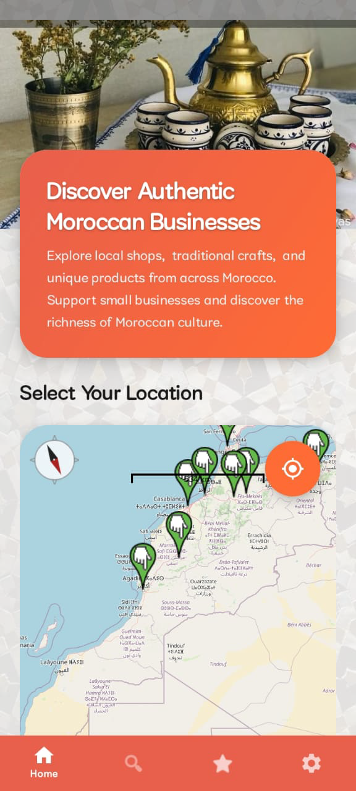
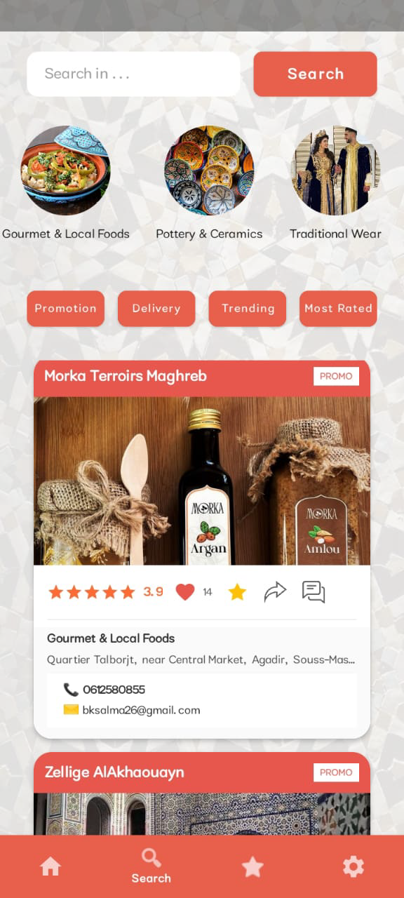
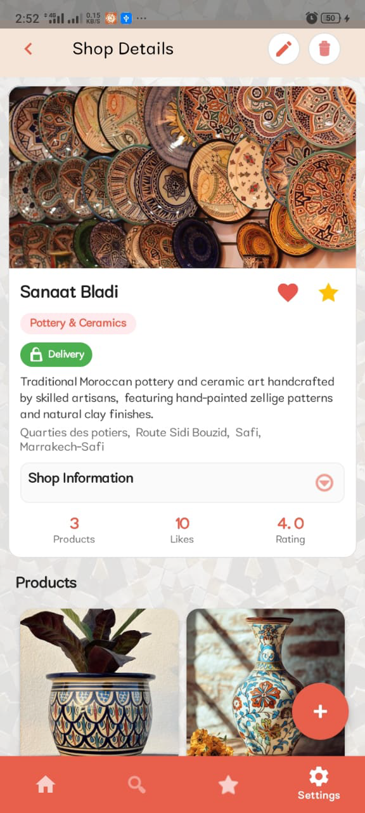
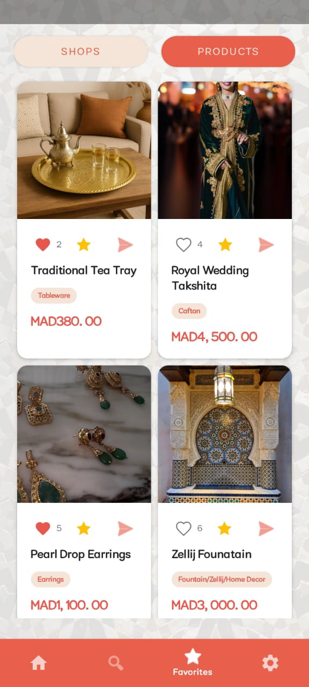

# 🏷️ Soukify: Discover Authentic Moroccan Businesses


[](https://developer.android.com/android)
[](https://firebase.google.com/)
[](https://www.java.com/)


**Soukify** is a premium Android application designed to promote Moroccan craftsmanship and connect local artisans with a global audience. It serves as a modern marketplace where traditional heritage meets digital convenience, allowing users to discover unique products from across Morocco's most iconic cities.

---

## 🌟 Key Features

### 🛍️ Smart Marketplace
- **Artisan-Centric Shops:** Browse categorized storefronts representing various Moroccan crafts.
- **Advanced Search:** Filter products by category, city, price, and even "Trending" status.
- **Discovery Mode:** Experience a proximity-based discovery system that highlights nearby shops.

### 🏺 Authentic Categories
Explore the richness of Morocco through specialized categories:
- **Textile & Tapestry** (Zellij, Carpets)
- **Pottery & Ceramics** (Fez, Safi styles)
- **Gourmet & Local Foods** (Argan oil, Spices)
- **Leather Crafts** (Marrakech Tanneries)
- **Natural Wellness** (Traditional beauty products)
- **Traditional Wear** (jellabas, Kaftans)

### 💬 Real-time Interaction
- **Integrated Chat:** Direct communication between buyers and sellers via **OneSignal** and **Firestore**.
- **Instant Inquiries:** Send pre-filled product inquiries to sellers in one tap.

### 📍 Interactive Location Services
- **Map Integration:** Built-in **OpenStreetMap (osmdroid)** to visualize shop locations.
- **City-Specific Browsing:** Quickly find artisans in Casablanca, Rabat, Marrakech, Fès, and more.

### 🔔 Intelligent Notifications
- **FCM Notifications:** Receive alerts for new messages, promotions, and new product launches.
- **Customizable Alerts:** Define "Quiet Hours" and notification preferences in settings.

---

## 🛠️ Technology Stack

| Layer | Technologies |
| :--- | :--- |
| **Frontend** | Android (Java), ViewBinding, Navigation Component |
| **Backend** | Firebase (Auth, Firestore, Cloud Functions, Messaging) |
| **Maps** | Osmdroid (OpenStreetMap) |
| **Storage** | Firebase Storage & Cloudinary (Media management) |
| **Real-time** | OneSignal (Push Notifications & Chat logic) |
| **Database** | Firestore (NoSQL) & Room (Local caching) |
| **Image Loading** | Glide (Fast & efficient media loading) |

---

## 📱 Screenshots

<p align="center">
  
</p>
<p align="center">
  
  
  
</p>
<p align="center">
  
  
</p>

---

## 🚀 Getting Started

### Prerequisites
- Android Studio Ladybug or later.
- JDK 11 or higher.
- A Firebase project with Firestore and Storage enabled.

### Installation
1. **Clone the repository:**
   ```bash
   git clone https://github.com/SalmasKit/SoukifyApp.git
   ```
2. **Setup Firebase:**
   - Download the `google-services.json` from your Firebase project.
   - Place it in the `app/` directory.
3. **Configure OneSignal:**
   - Add your OneSignal App ID in `manifest` or initialization logic.
4. **Deploy Cloud Functions:**
   - Navigate to the `functions/` folder.
   - Run `npm install` and `firebase deploy --only functions`.
5. **Build and Run:**
   - Sync Gradle and run the app on an emulator or physical device.

---

## 🏗️ Project Structure

```text
Soukify/
├── app/                  # Android application module
│   ├── src/main/java/    # Java source code (MVVM / Repository Pattern)
│   └── src/main/res/     # UI resources (Layouts, Strings, Drawables)
├── functions/            # Firebase Cloud Functions (Typescript/JS)
├── gradle/               # Gradle configuration files
└── build.gradle.kts      # Project-level dependencies
```

---

Developed with ❤️ for the Moroccan Craftsmanship Community.
